# QmlClassDiagram
Just Qml types dependency diagram build based on Qt 6.5 documentation

## Basic Qml types

```mermaid
---
title: QML Primitive types
---
graph BT
classDef CommentStyle fill:#1e1e1e,stroke-width:0px,color:#e3e3e4;
classDef QtStyle fill:#fbf2c4,stroke-width:0px,color:#111010,border-radius: 10px;

QVT(Value types):::CommentStyle
QLT(Language types):::CommentStyle
QMT(Module types):::CommentStyle

bool:::QtStyle
date:::QtStyle
double:::QtStyle
enumeration:::QtStyle
int:::QtStyle
list:::QtStyle
real:::QtStyle
string:::QtStyle
url:::QtStyle
var:::QtStyle
variant:::QtStyle
void:::QtStyle

color:::QtStyle
font:::QtStyle
matrix4x4:::QtStyle
point:::QtStyle
quaternion:::QtStyle
rect:::QtStyle
size:::QtStyle
vector2d:::QtStyle
vector3d:::QtStyle
vector4d:::QtStyle

click        bool href "https://doc.qt.io/qt-6/qml-bool.html"
click        date href "https://doc.qt.io/qt-6/qml-date.html"
click      double href "https://doc.qt.io/qt-6/qml-double.html"
click enumeration href "https://doc.qt.io/qt-6/qml-enumeration.html"
click         int href "https://doc.qt.io/qt-6/qml-int.html"
click        list href "https://doc.qt.io/qt-6/qml-list.html"
click        real href "https://doc.qt.io/qt-6/qml-real.html"
click      string href "https://doc.qt.io/qt-6/qml-string.html"
click         url href "https://doc.qt.io/qt-6/qml-url.html"
click         var href "https://doc.qt.io/qt-6/qml-var.html"
click     variant href "https://doc.qt.io/qt-6/qml-variant.html"
click        void href "https://doc.qt.io/qt-6/qml-void.html"

click      color href "https://doc.qt.io/qt-6/qml-color.html"
click       font href "https://doc.qt.io/qt-6/qml-font.html"
click  matrix4x4 href "https://doc.qt.io/qt-6/qml-matrix4x4.html"
click      point href "https://doc.qt.io/qt-6/qml-point.html"
click quaternion href "https://doc.qt.io/qt-6/qml-quaternion.html"
click       rect href "https://doc.qt.io/qt-6/qml-rect.html"
click       size href "https://doc.qt.io/qt-6/qml-size.html"
click   vector2d href "https://doc.qt.io/qt-6/qml-vector2d.html"
click   vector3d href "https://doc.qt.io/qt-6/qml-vector3d.html"
click   vector4d href "https://doc.qt.io/qt-6/qml-vector4d.html"


QLT --> QVT
QMT --> QVT

bool --> QLT
date --> QLT
double --> QLT
enumeration --> QLT
int --> QLT
list --> QLT
real --> QLT
string --> QLT
url --> QLT
var --> QLT
variant --> QLT
void --> QLT

color --> QMT
font --> QMT
matrix4x4 --> QMT
point --> QMT
quaternion --> QMT
rect --> QMT
size --> QMT
vector2d --> QMT
vector3d --> QMT
vector4d --> QMT
```

[Qml value types](https://doc.qt.io/qt-6/qtqml-typesystem-valuetypes.html) 

## QtQuick & QtQuick.Controls components

[QML QtQuick types](https://doc.qt.io/qt-6/qtquick-qmlmodule.html) 
[QML QtQuick.Controls types](https://doc.qt.io/qt-6/qtquick-controls-qmlmodule.html)

All this components are inplicitly nested from QtObject. This connection is omitted for the sake of diagram clarity.

```mermaid
---
title: QML Type Hierarchy
---
graph RL
classDef CommentStyle fill:#1e1e1e,stroke-width:0px,color:#e3e3e4;
classDef QtStyleQuick fill:#41cd52,stroke-width:0px,color:#121212;
classDef QtStyleQuickControls fill:#008585,stroke-width:0px,color:#121212;
classDef QtStyleQuickLayouts fill:#008585,stroke-width:0px,color:#121212;


Item:::QtStyleQuick
Control:::QtStyleQuickControls

subgraph RootAppComponents[Root application components]
direction RL
Application:::QtStyleQuick
ApplicationWindow:::QtStyleQuickControls
Window:::QtStyleQuick
Screen:::QtStyleQuick
end

subgraph AnimationGroup[Animation]
direction RL
AnchorAnimation:::QtStyleQuick
Animation(Animation):::QtStyleQuick
Animator:::QtStyleQuick
AnimationController:::QtStyleQuick
ParallelAnimation:::QtStyleQuick
ParentAnimation:::QtStyleQuick
PathAnimation:::QtStyleQuick
PauseAnimation:::QtStyleQuick
PropertyAction:::QtStyleQuick
SequentialAnimation:::QtStyleQuick
ScriptAction:::QtStyleQuick
FrameAnimation:::QtStyleQuick
PropertyAnimation:::QtStyleQuick
OpacityAnimator:::QtStyleQuick
ScaleAnimator:::QtStyleQuick
RotationAnimator:::QtStyleQuick
UniformAnimator:::QtStyleQuick
XAnimator:::QtStyleQuick
YAnimator:::QtStyleQuick
NumberAnimation:::QtStyleQuick
ColorAnimation:::QtStyleQuick
RotationAnimation:::QtStyleQuick
Vector3dAnimation:::QtStyleQuick
SmoothedAnimation:::QtStyleQuick
SpringAnimation:::QtStyleQuick
Transition:::QtStyleQuick
ViewTransition:::QtStyleQuick
end

subgraph Popups
direction RL
Popup:::QtStyleQuickControls
Dialog:::QtStyleQuickControls
Drawer:::QtStyleQuickControls
Menu:::QtStyleQuickControls
ToolTip:::QtStyleQuickControls
Overlay:::QtStyleQuickControls
end

subgraph Positioning[Positioning, Layouting, Navigation]
direction RL
Container:::QtStyleQuickControls
Flickable:::QtStyleQuick

subgraph ComponentLayouts[Component-level layouts]
direction RL
Row:::QtStyleQuick
RowLayout:::QtStyleQuickLayouts
Column:::QtStyleQuick
ColumnLayout:::QtStyleQuickLayouts
Grid:::QtStyleQuick
GridLayout:::QtStyleQuickLayouts
Flow:::QtStyleQuick
StackLayout:::QtStyleQuickLayouts
end

subgraph AppLayouting[App-level layouts]
direction RL
Pane:::QtStyleQuickControls
Frame:::QtStyleQuickControls
Page:::QtStyleQuickControls
ToolBar:::QtStyleQuickControls
ScrollView:::QtStyleQuickControls
SplitView:::QtStyleQuickControls
TabBar:::QtStyleQuickControls
MenuBar:::QtStyleQuickControls
ButtonGroup:::QtStyleQuickControls
DialogButtonBox:::QtStyleQuickControls
GroupBox:::QtStyleQuickControls
end

subgraph DynLayouts[Data-driven layouts]
direction RL
ListView:::QtStyleQuick
GridView:::QtStyleQuick
TableView:::QtStyleQuick
TreeView:::QtStyleQuick
HorizontalHeaderView:::QtStyleQuickControls
VerticalHeaderView:::QtStyleQuickControls
end

subgraph Navigators[Navigating layouts]
direction RL
SwipeView:::QtStyleQuickControls
StackView:::QtStyleQuickControls
Flipable:::QtStyleQuick
end

subgraph LayoutHelpers[Layout Helpers]
direction RL
Layout:::QtStyleQuickLayouts
LayoutMirroring:::QtStyleQuick
Positioner:::QtStyleQuick
SplitHandle:::QtStyleQuickControls
end

end

subgraph Input[Input methods]
direction RL
DragHandler:::QtStyleQuick
Drag:::QtStyleQuick
DropArea:::QtStyleQuick
MultiPointTouchArea:::QtStyleQuick
PointerDevice:::QtStyleQuick
TouchPoint:::QtStyleQuick
PinchHandler:::QtStyleQuick
PointerHandler:::QtStyleQuick
MouseArea:::QtStyleQuick
MultiPointHandler:::QtStyleQuick
PointerDeviceHandler:::QtStyleQuick
PinchArea:::QtStyleQuick
pointingDeviceUniqueId:::QtStyleQuick
SinglePointHandler:::QtStyleQuick
HoverHandler:::QtStyleQuick
TapHandler:::QtStyleQuick
PointHandler:::QtStyleQuick
WheelHandler:::QtStyleQuick

subgraph SpceificInput[Specific ui inputs]
direction RL
SpinBox:::QtStyleQuickControls
Tumbler:::QtStyleQuickControls
Slider:::QtStyleQuickControls
Dial:::QtStyleQuickControls
RangeSlider:::QtStyleQuickControls
ComboBox:::QtStyleQuickControls
end

subgraph ButtonContainer[Buttons]
direction RL
AbstractButton:::QtStyleQuickControls
Button:::QtStyleQuickControls
CheckBox:::QtStyleQuickControls
DelayButton:::QtStyleQuickControls
MenuItem:::QtStyleQuickControls
TabButton:::QtStyleQuickControls
RoundButton:::QtStyleQuickControls
ToolButton:::QtStyleQuickControls
Switch:::QtStyleQuickControls
RadioButton:::QtStyleQuickControls
MenuBarItem:::QtStyleQuickControls

subgraph Delegates
direction RL
ItemDelegate:::QtStyleQuickControls
CheckDelegate:::QtStyleQuickControls
RadioDelegate:::QtStyleQuickControls
SwipeDelegate:::QtStyleQuickControls
SwitchDelegate:::QtStyleQuickControls
TreeViewDelegate:::QtStyleQuickControls
end

end

subgraph KeysGroup[Keys]
direction RL
Keys:::QtStyleQuick
KeyNavigation:::QtStyleQuick
Shortcut:::QtStyleQuick
end

subgraph TextGroup[Text]
direction RL
InputMethod:::QtStyleQuick
EnterKey:::QtStyleQuick
TextEdit:::QtStyleQuick
TextArea:::QtStyleQuickControls
TextField:::QtStyleQuickControls
TextInput:::QtStyleQuick
end

end

subgraph Shapes
direction RL
PathCubic:::QtStyleQuick
PathCurve:::QtStyleQuick
PathQuad:::QtStyleQuick
PathSvg:::QtStyleQuick
PathAttribute:::QtStyleQuick
PathElement:::QtStyleQuick
PathInterpolator:::QtStyleQuick
PathMove:::QtStyleQuick
PathMultiline:::QtStyleQuick
PathPercent:::QtStyleQuick
PathPolyline:::QtStyleQuick
PathView:::QtStyleQuick
PathAngleArc:::QtStyleQuick
PathArc:::QtStyleQuick
PathText:::QtStyleQuick
PathLine:::QtStyleQuick
Path:::QtStyleQuick
end

subgraph Events
direction RL
CloseEvent:::QtStyleQuick
DragEvent:::QtStyleQuick
WheelEvent:::QtStyleQuick
GestureEvent:::QtStyleQuick
KeyEvent:::QtStyleQuick
MouseEvent:::QtStyleQuick
PinchEvent:::QtStyleQuick
PointerEvent:::QtStyleQuick
eventPoint:::QtStyleQuick
handlerPoint:::QtStyleQuick
end

subgraph Transforms[Transform]
direction RL
Transform:::QtStyleQuick
Rotation:::QtStyleQuick
Scale:::QtStyleQuick
Translate:::QtStyleQuick
Matrix4x4:::QtStyleQuick
end

subgraph Builders
direction RL
Loader:::QtStyleQuick
Repeater:::QtStyleQuick
end

subgraph Validators
direction RL
DoubleValidator:::QtStyleQuick
IntValidator:::QtStyleQuick
RegularExpressionValidator:::QtStyleQuick
end

subgraph StateControl[State control]
direction RL
State:::QtStyleQuick
StateChangeScript:::QtStyleQuick
StateGroup:::QtStyleQuick
end

subgraph CanvasStuff[Canvas]
direction RL
Canvas:::QtStyleQuick
CanvasGradient:::QtStyleQuick
CanvasImageData:::QtStyleQuick
CanvasPixelArray:::QtStyleQuick
end

subgraph OtherStuff[Other]
direction RL
FontLoader:::QtStyleQuick
Accessible:::QtStyleQuick
AnchorChanges:::QtStyleQuick
AnimatedImage:::QtStyleQuick
AnimatedSprite:::QtStyleQuick
Behavior:::QtStyleQuick
BorderImage:::QtStyleQuick
BorderImageMesh:::QtStyleQuick
ColorGroup:::QtStyleQuick
Context2D:::QtStyleQuick
FocusScope:::QtStyleQuick
FontMetrics:::QtStyleQuick
Gradient:::QtStyleQuick
GradientStop:::QtStyleQuick
GraphicsInfo:::QtStyleQuick
GridMesh:::QtStyleQuick
Image:::QtStyleQuick
ItemGrabResult:::QtStyleQuick
Palette:::QtStyleQuick
ParentChange:::QtStyleQuick
PropertyChanges:::QtStyleQuick
Rectangle:::QtStyleQuick
ShaderEffect:::QtStyleQuick
ShaderEffectSource:::QtStyleQuick
Sprite:::QtStyleQuick
SpriteSequence:::QtStyleQuick
SystemPalette:::QtStyleQuick
Text:::QtStyleQuick
TextMetrics:::QtStyleQuick
Action:::QtStyleQuickControls
ActionGroup:::QtStyleQuickControls
Label:::QtStyleQuickControls
SelectionRectangle:::QtStyleQuickControls
end

subgraph HelperUiElements[Helper ui elements]
direction RL

subgraph Separators[Separators]
direction RL
ToolSeparator:::QtStyleQuickControls
MenuSeparator:::QtStyleQuickControls
end

subgraph WaitIndicator[Wait indicators]
direction RL
BusyIndicator:::QtStyleQuickControls
ProgressBar:::QtStyleQuickControls
end

subgraph NavIndicators[Navigation indicators]
direction RL
ScrollBar:::QtStyleQuickControls
ScrollIndicator:::QtStyleQuickControls
PageIndicator:::QtStyleQuickControls
end

subgraph CalendarStuff[Calendar]
direction RL
Calendar:::QtStyleQuickControls
CalendarModel:::QtStyleQuickControls
MonthGrid:::QtStyleQuickControls
DayOfWeekRow:::QtStyleQuickControls
WeekNumberColumn:::QtStyleQuickControls
end

end

%% Accessible --> QtObject
AnchorAnimation --> Animation
%% AnchorChanges --> QtObject
AnimatedImage --> Image
AnimatedSprite --> Item
%% Animation --> QtObject
%% AnimationController --> QtObject
Animator --> Animation
%% Application --> QtObject
%% Behavior --> QtObject
BorderImage --> Item
%% BorderImageMesh --> QtObject
Canvas --> Item
%% CanvasGradient --> QtObject
%% CanvasImageData --> QtObject
%% CanvasPixelArray --> QtObject
%% CloseEvent --> QtObject
ColorAnimation --> PropertyAnimation
%% ColorGroup --> QtObject
Column --> Item
%% Context2D --> QtObject
%% Drag --> QtObject
%% DragEvent --> QtObject
DragHandler --> MultiPointHandler
DropArea --> Item
%% EnterKey --> QtObject
Flickable --> Item
Flipable --> Item
Flow --> Item
FocusScope --> Item
%% FontLoader --> QtObject
%% FontMetrics --> QtObject
%% FrameAnimation --> QtObject
%% GestureEvent --> QtObject
%% GradientStop --> QtObject
%% GraphicsInfo --> QtObject
Grid --> Item
%% GridMesh --> QtObject
GridView --> Flickable
HoverHandler --> SinglePointHandler
Image --> Item
%% InputMethod --> QtObject
%% Item --> QtObject
%% ItemGrabResult --> QtObject
%% KeyEvent --> QtObject
%% KeyNavigation --> QtObject
%% Keys --> QtObject
%% LayoutMirroring --> QtObject
ListView --> Flickable
Loader --> Item
Matrix4x4 --> Transform
MouseArea --> Item
%% MouseEvent --> QtObject
MultiPointHandler --> PointerDeviceHandler
MultiPointTouchArea --> Item
NumberAnimation --> PropertyAnimation
OpacityAnimator --> Animator
%% Palette --> QtObject
ParallelAnimation --> Animation
ParentAnimation --> Animation
%% ParentChange --> QtObject
%% Path --> QtObject
%% PathAngleArc --> QtObject
PathAnimation --> Animation
%% PathArc --> QtObject
%% PathAttribute --> QtObject
%% PathCubic --> QtObject
%% PathCurve --> QtObject
%% PathElement --> QtObject
%% PathInterpolator --> QtObject
%% PathLine --> QtObject
%% PathMove --> QtObject
%% PathMultiline --> QtObject
%% PathPercent --> QtObject
%% PathPolyline --> QtObject
%% PathQuad --> QtObject
%% PathSvg --> QtObject
%% PathText --> QtObject
%% PathView --> QtObject
PauseAnimation --> Animation
PinchArea --> Item
%% PinchEvent --> QtObject
PinchHandler --> MultiPointHandler
PointHandler --> SinglePointHandler
%% PointerDevice --> QtObject
PointerDeviceHandler --> PointerHandler
%% PointerEvent --> QtObject
%% PointerHandler --> QtObject
%% Positioner --> QtObject
PropertyAction --> Animation
PropertyAnimation --> Animation
%% PropertyChanges --> QtObject
Rectangle --> Item
%% RegularExpressionValidator --> QtObject
Repeater --> Item
Rotation --> Transform
RotationAnimation --> PropertyAnimation
RotationAnimator --> Animator
Row --> Item
Scale --> Transform
ScaleAnimator --> Animator
%% Screen --> QtObject
ScriptAction --> Animation
SequentialAnimation --> Animation
ShaderEffect --> Item
ShaderEffectSource --> Item
%% Shortcut --> QtObject
SinglePointHandler --> PointerDeviceHandler
SmoothedAnimation --> NumberAnimation
SpringAnimation --> NumberAnimation
%% Sprite --> QtObject
SpriteSequence --> Item
%% State --> QtObject
%% StateChangeScript --> QtObject
%% StateGroup --> QtObject
%% SystemPalette --> QtObject
TableView --> Flickable
TapHandler --> SinglePointHandler
Text --> Item
TextEdit --> Item
TextInput --> Item
%% TextMetrics --> QtObject
%% TouchPoint --> QtObject
%% Transform --> QtObject
%% Transition --> QtObject
Translate --> Transform
TreeView --> TableView
UniformAnimator --> Animator
Vector3dAnimation --> PropertyAnimation
%% ViewTransition --> QtObject
%% WheelEvent --> QtObject
WheelHandler --> SinglePointHandler
%% Window --> QQuickWindow
%% QQuickWindow --> QtObject
XAnimator --> Animator
YAnimator --> Animator

ColumnLayout --> Item
GridLayout --> Item
%% Layout --> QtObject
RowLayout --> Item
StackLayout --> Item

AbstractButton --> Control
%% Action --> QtObject
%% ActionGroup --> QtObject
ApplicationWindow --> Window
BusyIndicator --> Control
Button --> AbstractButton
%% ButtonGroup --> QtObject
CheckBox --> AbstractButton
CheckDelegate --> ItemDelegate
ComboBox --> Control
Container --> Control
Control --> Item
DayOfWeekRow --> Control
DelayButton --> AbstractButton
Dial --> Control
Dialog --> Popup
DialogButtonBox --> Container
Drawer --> Popup
Frame --> Pane
GroupBox --> Frame
HorizontalHeaderView --> TableView
ItemDelegate --> AbstractButton
Label --> Text
Menu --> Popup
MenuBar --> Container
MenuBarItem --> AbstractButton
MenuItem --> AbstractButton
MenuSeparator --> Control
MonthGrid --> Control
Overlay --> Item
Page --> Pane
PageIndicator --> Control
Pane --> Control
%% Popup --> QtObject
ProgressBar --> Control
RadioButton --> AbstractButton
RadioDelegate --> ItemDelegate
RangeSlider --> Control
RoundButton --> Button
ScrollBar --> Control
ScrollIndicator --> Control
ScrollView --> Pane
SelectionRectangle --> Control
Slider --> Control
SpinBox --> Control
%% SplitHandle --> QtObject
SplitView --> Container
StackView --> Control
SwipeDelegate --> ItemDelegate
SwipeView --> Container
Switch --> AbstractButton
SwitchDelegate --> ItemDelegate
TabBar --> Container
TabButton --> AbstractButton
TextArea --> TextEdit
TextField --> TextInput
ToolBar --> Pane
ToolButton --> Button
ToolSeparator --> Control
ToolTip --> Popup
TreeViewDelegate --> ItemDelegate
Tumbler --> Control
VerticalHeaderView --> TableView
WeekNumberColumn --> Control
```

