# QmlClassDiagram
Just Qml types dependency diagram build based on Qt 6.5 documentation

[Qml value types](https://doc.qt.io/qt-6/qtqml-typesystem-valuetypes.html) 
[QML QtQuick types](https://doc.qt.io/qt-6/qtquick-qmlmodule.html) 
[QML QtQuick.Controls types](https://doc.qt.io/qt-6/qtquick-controls-qmlmodule.html)

```mermaid
---
title: QML Type Hierarchy
---
graph RL
classDef CommentStyle fill:#1e1e1e,stroke-width:0px,color:#e3e3e4;
classDef QtStyle fill:#41cd52,stroke-width:0px,color:#121212;
classDef QtStyleQuick fill:#41cd52,stroke-width:0px,color:#121212;
classDef QtStyleQuickControls fill:#41cd52,stroke-width:0px,color:#121212;

subgraph RL Primitives[Primitive types]
direction RL
QVT(Value types):::CommentStyle
QLT(Language types):::CommentStyle
QMT(Module types):::CommentStyle

bool:::QtStyle
date:::QtStyle
double:::QtStyle
enumeration:::QtStyle
int:::QtStyle
list:::QtStyle
real:::QtStyle
string:::QtStyle
url:::QtStyle
var:::QtStyle
variant:::QtStyle
void:::QtStyle

color:::QtStyle
font:::QtStyle
matrix4x4:::QtStyle
point:::QtStyle
quaternion:::QtStyle
rect:::QtStyle
size:::QtStyle
vector2d:::QtStyle
vector3d:::QtStyle
vector4d:::QtStyle
end

subgraph RL AnimationGroup[Animation]
direction RL
AnchorAnimation:::QtStyleQuick
Animation:::QtStyleQuick
Animator:::QtStyleQuick
ColorAnimation:::QtStyleQuick
ParallelAnimation:::QtStyleQuick
ParentAnimation:::QtStyleQuick
PathAnimation:::QtStyleQuick
PauseAnimation:::QtStyleQuick
PropertyAction:::QtStyleQuick
SequentialAnimation:::QtStyleQuick
ScriptAction:::QtStyleQuick
PropertyAnimation:::QtStyleQuick
OpacityAnimator:::QtStyleQuick
ScaleAnimator:::QtStyleQuick
RotationAnimator:::QtStyleQuick
UniformAnimator:::QtStyleQuick
XAnimator:::QtStyleQuick
YAnimator:::QtStyleQuick
NumberAnimation:::QtStyleQuick
SmoothedAnimation:::QtStyleQuick
SpringAnimation:::QtStyleQuick
RotationAnimation:::QtStyleQuick
Vector3dAnimation:::QtStyleQuick
end

Accessible:::QtStyleQuick
AnchorChanges:::QtStyleQuick
AnimatedImage:::QtStyleQuick
AnimatedSprite:::QtStyleQuick
AnimationController:::QtStyleQuick
Application:::QtStyleQuick
Behavior:::QtStyleQuick
BorderImage:::QtStyleQuick
BorderImageMesh:::QtStyleQuick
Canvas:::QtStyleQuick
CanvasGradient:::QtStyleQuick
CanvasImageData:::QtStyleQuick
CanvasPixelArray:::QtStyleQuick
CloseEvent:::QtStyleQuick
ColorGroup:::QtStyleQuick
Column:::QtStyleQuick
Context2D:::QtStyleQuick
DoubleValidator:::QtStyleQuick
Drag:::QtStyleQuick
DragEvent:::QtStyleQuick
DragHandler:::QtStyleQuick
DropArea:::QtStyleQuick
EnterKey:::QtStyleQuick
Flickable:::QtStyleQuick
Flipable:::QtStyleQuick
Flow:::QtStyleQuick
FocusScope:::QtStyleQuick
FontLoader:::QtStyleQuick
FontMetrics:::QtStyleQuick
FrameAnimation:::QtStyleQuick
GestureEvent:::QtStyleQuick
Gradient:::QtStyleQuick
GradientStop:::QtStyleQuick
GraphicsInfo:::QtStyleQuick
Grid:::QtStyleQuick
GridMesh:::QtStyleQuick
GridView:::QtStyleQuick
HoverHandler:::QtStyleQuick
Image:::QtStyleQuick
InputMethod:::QtStyleQuick
IntValidator:::QtStyleQuick
Item:::QtStyleQuick
ItemGrabResult:::QtStyleQuick
KeyEvent:::QtStyleQuick
KeyNavigation:::QtStyleQuick
Keys:::QtStyleQuick
LayoutMirroring:::QtStyleQuick
ListView:::QtStyleQuick
Loader:::QtStyleQuick
Matrix4x4:::QtStyleQuick
MouseArea:::QtStyleQuick
MouseEvent:::QtStyleQuick
MultiPointHandler:::QtStyleQuick
MultiPointTouchArea:::QtStyleQuick
Palette:::QtStyleQuick
ParentChange:::QtStyleQuick
Path:::QtStyleQuick
PathAngleArc:::QtStyleQuick
PathArc:::QtStyleQuick
PathAttribute:::QtStyleQuick
PathCubic:::QtStyleQuick
PathCurve:::QtStyleQuick
PathElement:::QtStyleQuick
PathInterpolator:::QtStyleQuick
PathLine:::QtStyleQuick
PathMove:::QtStyleQuick
PathMultiline:::QtStyleQuick
PathPercent:::QtStyleQuick
PathPolyline:::QtStyleQuick
PathQuad:::QtStyleQuick
PathSvg:::QtStyleQuick
PathText:::QtStyleQuick
PathView:::QtStyleQuick
PinchArea:::QtStyleQuick
PinchEvent:::QtStyleQuick
PinchHandler:::QtStyleQuick
PointHandler:::QtStyleQuick
PointerDevice:::QtStyleQuick
PointerDeviceHandler:::QtStyleQuick
PointerEvent:::QtStyleQuick
PointerHandler:::QtStyleQuick
Positioner:::QtStyleQuick
PropertyChanges:::QtStyleQuick
Rectangle:::QtStyleQuick
RegularExpressionValidator:::QtStyleQuick
Repeater:::QtStyleQuick
Rotation:::QtStyleQuick
Row:::QtStyleQuick
Scale:::QtStyleQuick
Screen:::QtStyleQuick
ShaderEffect:::QtStyleQuick
ShaderEffectSource:::QtStyleQuick
Shortcut:::QtStyleQuick
SinglePointHandler:::QtStyleQuick
Sprite:::QtStyleQuick
SpriteSequence:::QtStyleQuick
State:::QtStyleQuick
StateChangeScript:::QtStyleQuick
StateGroup:::QtStyleQuick
SystemPalette:::QtStyleQuick
TableView:::QtStyleQuick
TapHandler:::QtStyleQuick
Text:::QtStyleQuick
TextEdit:::QtStyleQuick
TextInput:::QtStyleQuick
TextMetrics:::QtStyleQuick
TouchPoint:::QtStyleQuick
Transform:::QtStyleQuick
Transition:::QtStyleQuick
Translate:::QtStyleQuick
TreeView:::QtStyleQuick
ViewTransition:::QtStyleQuick
WheelEvent:::QtStyleQuick
WheelHandler:::QtStyleQuick
Window:::QtStyleQuick
eventPoint:::QtStyleQuick
handlerPoint:::QtStyleQuick
pointingDeviceUniqueId:::QtStyleQuick

AbstractButton:::QtStyleQuickControls
Action:::QtStyleQuickControls
ActionGroup:::QtStyleQuickControls
ApplicationWindow:::QtStyleQuickControls
BusyIndicator:::QtStyleQuickControls
Button:::QtStyleQuickControls
ButtonGroup:::QtStyleQuickControls
Calendar:::QtStyleQuickControls
CalendarModel:::QtStyleQuickControls
CheckBox:::QtStyleQuickControls
CheckDelegate:::QtStyleQuickControls
ComboBox:::QtStyleQuickControls
Container:::QtStyleQuickControls
Control:::QtStyleQuickControls
DayOfWeekRow:::QtStyleQuickControls
DelayButton:::QtStyleQuickControls
Dial:::QtStyleQuickControls
Dialog:::QtStyleQuickControls
DialogButtonBox:::QtStyleQuickControls
Drawer:::QtStyleQuickControls
Frame:::QtStyleQuickControls
GroupBox:::QtStyleQuickControls
HorizontalHeaderView:::QtStyleQuickControls
ItemDelegate:::QtStyleQuickControls
Label:::QtStyleQuickControls
Menu:::QtStyleQuickControls
MenuBar:::QtStyleQuickControls
MenuBarItem:::QtStyleQuickControls
MenuItem:::QtStyleQuickControls
MenuSeparator:::QtStyleQuickControls
MonthGrid:::QtStyleQuickControls
Overlay:::QtStyleQuickControls
Page:::QtStyleQuickControls
PageIndicator:::QtStyleQuickControls
Pane:::QtStyleQuickControls
Popup:::QtStyleQuickControls
ProgressBar:::QtStyleQuickControls
RadioButton:::QtStyleQuickControls
RadioDelegate:::QtStyleQuickControls
RangeSlider:::QtStyleQuickControls
RoundButton:::QtStyleQuickControls
ScrollBar:::QtStyleQuickControls
ScrollIndicator:::QtStyleQuickControls
ScrollView:::QtStyleQuickControls
SelectionRectangle:::QtStyleQuickControls
Slider:::QtStyleQuickControls
SpinBox:::QtStyleQuickControls
SplitHandle:::QtStyleQuickControls
SplitView:::QtStyleQuickControls
StackView:::QtStyleQuickControls
SwipeDelegate:::QtStyleQuickControls
SwipeView:::QtStyleQuickControls
Switch:::QtStyleQuickControls
SwitchDelegate:::QtStyleQuickControls
TabBar:::QtStyleQuickControls
TabButton:::QtStyleQuickControls
TextArea:::QtStyleQuickControls
TextField:::QtStyleQuickControls
ToolBar:::QtStyleQuickControls
ToolButton:::QtStyleQuickControls
ToolSeparator:::QtStyleQuickControls
ToolTip:::QtStyleQuickControls
TreeViewDelegate:::QtStyleQuickControls
Tumbler:::QtStyleQuickControls
VerticalHeaderView:::QtStyleQuickControls
WeekNumberColumn:::QtStyleQuickControls


QLT --> QVT
QMT --> QVT

bool --> QLT
date --> QLT
double --> QLT
enumeration --> QLT
int --> QLT
list --> QLT
real --> QLT
string --> QLT
url --> QLT
var --> QLT
variant --> QLT
void --> QLT

color --> QMT
font --> QMT
matrix4x4 --> QMT
point --> QMT
quaternion --> QMT
rect --> QMT
size --> QMT
vector2d --> QMT
vector3d --> QMT
vector4d --> QMT

Accessible --> QtObject
AnchorAnimation --> Animation
AnchorChanges --> QtObject
AnimatedImage --> Image
AnimatedSprite --> Item
Animation --> QtObject
AnimationController --> QtObject
Animator --> Animation
Application --> QtObject
Behavior --> QtObject
BorderImage --> Item
BorderImageMesh --> QtObject
Canvas --> Item
CanvasGradient --> QtObject
CanvasImageData --> QtObject
CanvasPixelArray --> QtObject
CloseEvent --> QtObject
ColorAnimation --> PropertyAnimation
ColorGroup --> QtObject
Column --> Item
Context2D --> QtObject
DoubleValidator --> QDoubleValidator
Drag --> QtObject
DragEvent --> QtObject
DragHandler --> MultiPointHandler
DropArea --> Item
EnterKey --> QtObject
Flickable --> Item
Flipable --> Item
Flow --> Item
FocusScope --> Item
FontLoader --> QtObject
FontMetrics --> QtObject
FrameAnimation --> QtObject
GestureEvent --> QtObject
Gradient --> ShapeGradient
GradientStop --> QtObject
GraphicsInfo --> QtObject
Grid --> Item
GridMesh --> QtObject
GridView --> Flickable
HoverHandler --> SinglePointHandler
Image --> Item
InputMethod --> QtObject
IntValidator --> QIntValidator
Item --> QtObject
ItemGrabResult --> QtObject
KeyEvent --> QtObject
KeyNavigation --> QtObject
Keys --> QtObject
LayoutMirroring --> QtObject
ListView --> Flickable
Loader --> Item
Matrix4x4 --> QtObject
MouseArea --> Item
MouseEvent --> QtObject
MultiPointHandler --> PointerDeviceHandler
MultiPointTouchArea --> Item
NumberAnimation --> PropertyAnimation
OpacityAnimator --> Animator
Palette --> QtObject
ParallelAnimation --> Animation
ParentAnimation --> Animation
ParentChange --> QtObject
Path --> ShapePath
PathAngleArc --> QtObject
PathAnimation --> Animation
PathArc --> QtObject
PathAttribute --> QtObject
PathCubic --> QtObject
PathCurve --> QtObject
PathElement --> QtObject
PathInterpolator --> QtObject
PathLine --> QtObject
PathMove --> QtObject
PathMultiline --> QtObject
PathPercent --> QtObject
PathPolyline --> QtObject
PathQuad --> QtObject
PathSvg --> QtObject
PathText --> QtObject
PathView --> QtObject
PauseAnimation --> Animation
PinchArea --> Item
PinchEvent --> QtObject
PinchHandler --> MultiPointHandler
PointHandler --> SinglePointHandler
PointerDevice --> QtObject
PointerDeviceHandler --> PointerHandler
PointerEvent --> QtObject
PointerHandler --> QtObject
Positioner --> QtObject
PropertyAction --> Animation
PropertyAnimation --> Animation
PropertyChanges --> QtObject
Rectangle --> Item
RegularExpressionValidator --> QtObject
Repeater --> Item
Rotation --> QtObject
RotationAnimation --> PropertyAnimation
RotationAnimator --> Animator
Row --> Item
Scale --> QtObject
ScaleAnimator --> Animator
Screen --> QtObject
ScriptAction --> Animation
SequentialAnimation --> Animation
ShaderEffect --> Item
ShaderEffectSource --> Item
Shortcut --> QtObject
SinglePointHandler --> PointerDeviceHandler
SmoothedAnimation --> NumberAnimation
SpringAnimation --> NumberAnimation
Sprite --> QtObject
SpriteSequence --> Item
State --> QtObject
StateChangeScript --> QtObject
StateGroup --> QtObject
SystemPalette --> QtObject
TableView --> Flickable
TapHandler --> SinglePointHandler
Text --> Item
TextEdit --> Item
TextInput --> Item
TextMetrics --> QtObject
TouchPoint --> QtObject
Transform --> QtObject
Transition --> QtObject
Translate --> QtObject
TreeView --> TableView
UniformAnimator --> Animator
Vector3dAnimation --> PropertyAnimation
ViewTransition --> QtObject
WheelEvent --> QtObject
WheelHandler --> SinglePointHandler
Window --> QQuickWindow
QQuickWindow --> QtObject
XAnimator --> Animator
YAnimator --> Animator

AbstractButton --> Control
Action --> QtObject
ActionGroup --> QtObject
ApplicationWindow --> Window
BusyIndicator --> Control
Button --> AbstractButton
ButtonGroup --> QtObject
CheckBox --> AbstractButton
CheckDelegate --> ItemDelegate
ComboBox --> Control
Container --> Control
Control --> Item
DayOfWeekRow --> Control
DelayButton --> AbstractButton
Dial --> Control
Dialog --> Popup
DialogButtonBox --> Container
Container --> Control
Drawer --> Popup
Frame --> Pane
GroupBox --> Frame
HorizontalHeaderView --> TableView
ItemDelegate --> AbstractButton
Label --> Text
Menu --> Popup
MenuBar --> Container
MenuBarItem --> AbstractButton
MenuItem --> AbstractButton
MenuSeparator --> Control
MonthGrid --> Control
Overlay --> Item
Page --> Pane
PageIndicator --> Control
Pane --> Control
Popup --> QtObject
ProgressBar --> Control
RadioButton --> AbstractButton
RadioDelegate --> ItemDelegate
RangeSlider --> Control
RoundButton --> Button
ScrollBar --> Control
ScrollIndicator --> Control
ScrollView --> Pane
SelectionRectangle --> Control
Slider --> Control
SpinBox --> Control
SplitHandle --> QtObject
SplitView --> Container
StackView --> Control
SwipeDelegate --> ItemDelegate
SwipeView --> Container
Switch --> AbstractButton
SwitchDelegate --> ItemDelegate
TabBar --> Container
TabButton --> AbstractButton
TextArea --> TextEdit
TextField --> TextInput
ToolBar --> Pane
ToolButton --> Button
ToolSeparator --> Control
ToolTip --> Popup
TreeViewDelegate --> ItemDelegate
Tumbler --> Control
VerticalHeaderView --> TableView
WeekNumberColumn --> Control
```

